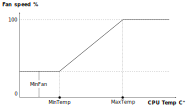

# Pi-fan introduction
Pi-fan is a small server (written in C) that can control a fan on a Raspberry Pi based on CPU temperature. For now I have only tested if this works with a Raspberry Pi 4, but it should work on all Pi's with pin 12 (BC pin 18 with PWM channel 0) available. Pi-fan works by controlling a fan with a standard 4-pin PWM (25KHz) input. It uses hardware PWM and hence uses very few cpu cycles, and generally has a very small foot print. Pi-fan uses [Mike McCauley's excellent little library bcm2835](https://www.airspayce.com/mikem/bcm2835).

# Getting your fan up to speed
In general terms you need to go through these steps to control your fan with pi-fan:
1. Choose a suitable fan with a standard 4-wire 25KHz PWM control input.
2. Interface your fan electrically to the Pi. The gpio pins on the Pi uses 3.3V, which probably needs to be adapted to 5V or more to fit match the fan.
3. Get a compiled pi-fan executable installed on your Pi and hooked into systemd.

You can find more detailed information about each of these steps via these links:
* [**Electrically interfacing your fan**](docs/electrical_interface.md)
* [**Compiling pi-fan from source**](docs/compiling_pi-fan.md)
* [**Installing pi-fan and hooking into systemd**](systemd_install.md)

# Some high-lights
Pi-fan uses hardware pwm and hence uses very few cpu ressources. Pi-fan is intended to be run  via systemd, so that it starts and stops automatically. There's a small systemd service unit ready-for-use in the folder systemd.

Pi-fan allows you to configure the parameters listed below. While there's ample opportunity to tweak around, pi-fan works very well with the default values (listed in parenthesis)
1. Core temperature sample period, i.e. the interval between measurement of the core temperature (2 seconds).
2. How many temperature samples should be used to form the running average temperature which is used to control the fan (5).
3. **MinFan**: The lowest fan level to use (fan speed will never go below this value) (20%).
4. **MinTemp**: The minimum temperature at which pi-fan starts to increase the fan speed (30 degrees Celcius).
5. **MaxTemp**: The temperature at which the fan speed should reach 100% (55 degrees Celcius).
6. The fan level to set if pi-fan is asked to stop (50%).

This figure illustrates some of these parameters:

So the fan speed never goes under MinFan. Once the temperature reaches MinTemp, pi-fan starts to ramp up the fan speed until it reaches 100% at MaxTemp. The fan ramp-up is linear.

# Build instructions
More will be forthcoming, but for now you need to know (at least) this: pi-fan uses Mike McCauley's excellent little Pi gpio library called bcm2835 (link: https://www.airspayce.com/mikem/bcm2835/index.html). For now pi-fan compiles/links bcm2835 statically into the binary, and you need to grab bcm2835 from the link, and place the two files `bcm2835.h` and `bcm2835.c` into the `include/` and `src/` folders, respectively. The CMake build assumes that these 2 files can be found in the folders as described.

